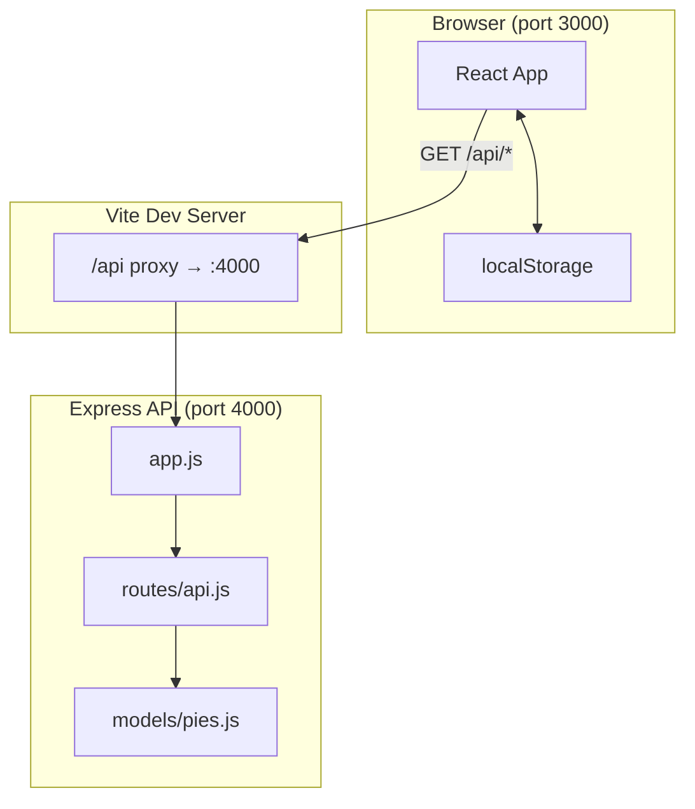
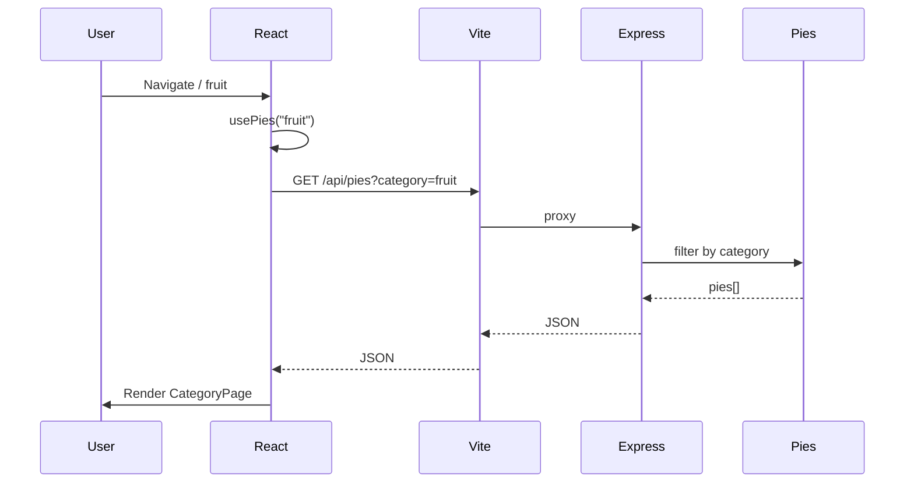
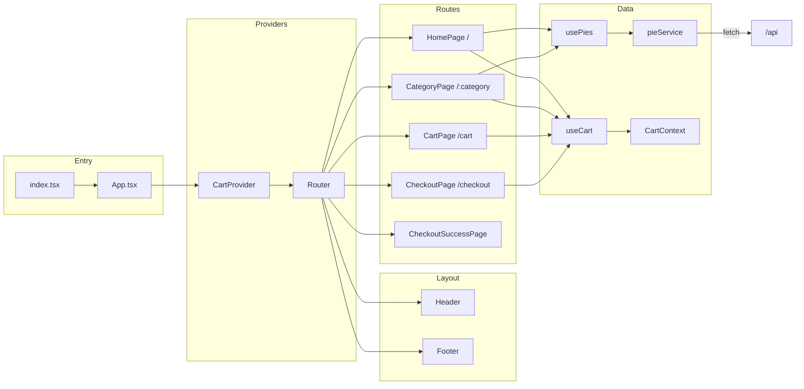
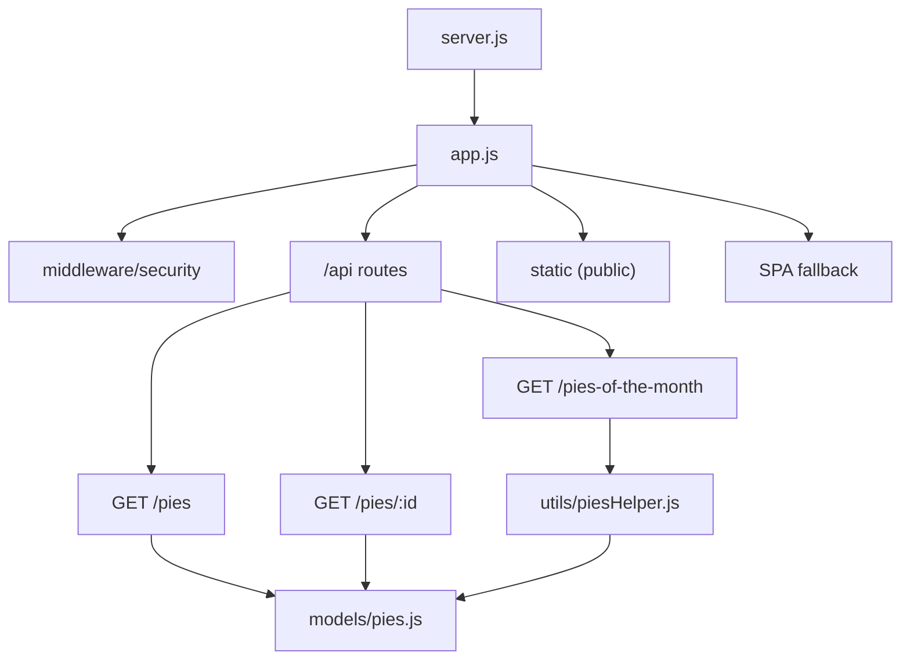
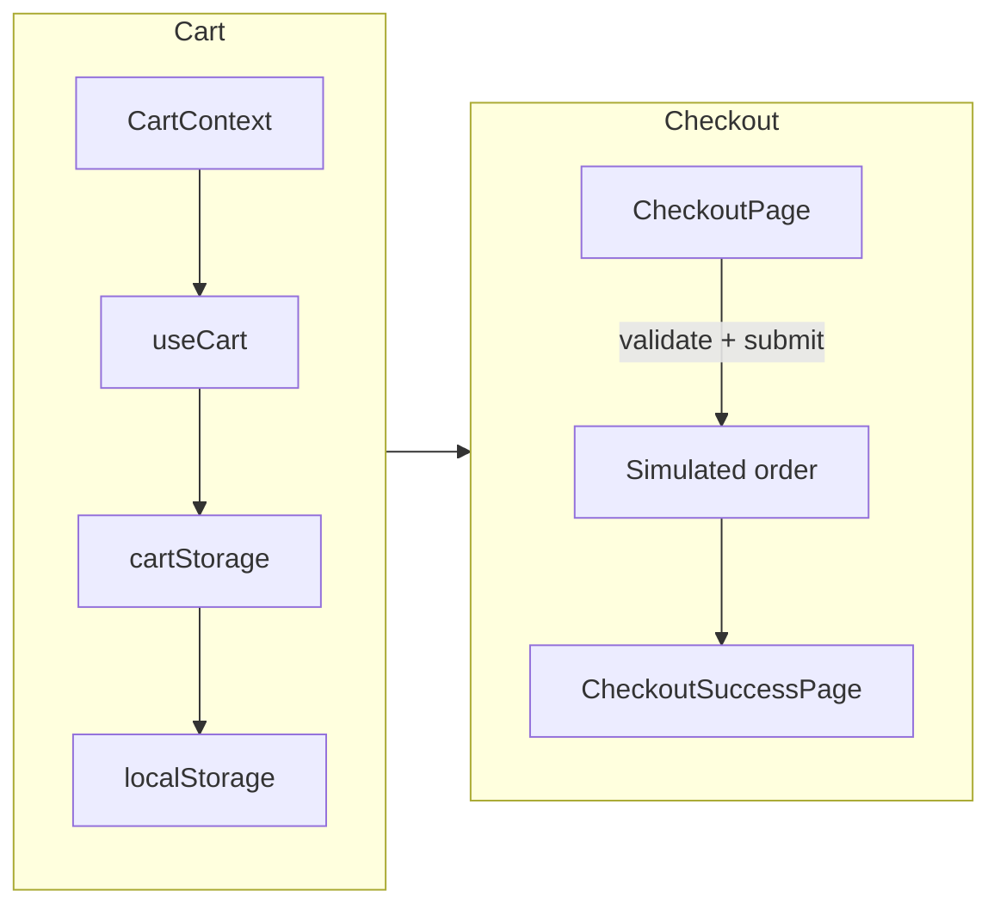

# Bethany's Pie Shop — Architecture

## High-level system

## Request flow (data path)

## Frontend structure

## Backend structure

## Cart and checkout flow

---

_Generated for onboarding. See README.md for setup and scripts._
